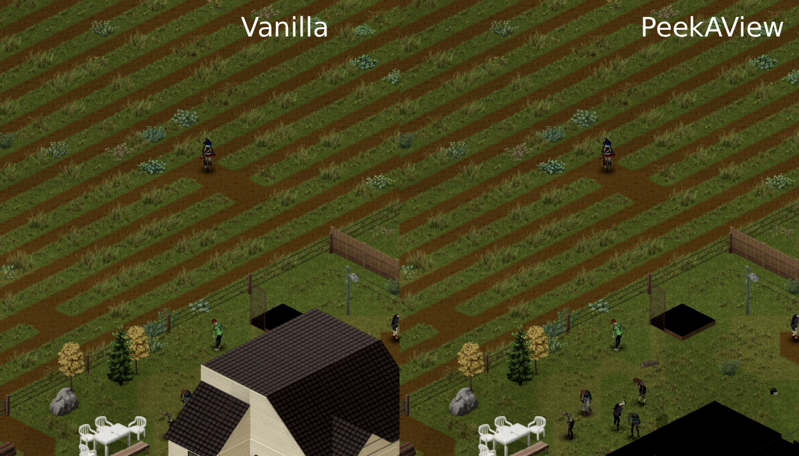

# Peek a View

Project Zomboid mod — extends the wall and building cutaway range so zombies hiding in your line of sight stop being invisible.

In vanilla PZ, walls and roofs only fade out within roughly 5 tiles of your character — so the player behind the screen sees less than the character actually can. A zombie leaning against a house wall or hiding behind a tall fence stays completely invisible to you, even when your character is looking straight at it. Peek a View closes that gap: houses and view-blocking fences fade from further away, so what reaches your screen matches (mostly) what your character can see.

## Features

- **Extended cutaway range** — configurable slider from 5 (vanilla) to 20 tiles.
- **Driving-speed gate** — auto-disables above a configurable km/h to keep FPS smooth on lower-end hardware. Default 35 km/h. `0` = always off in a vehicle; `120` = always on.
- **Optional nimble-stance-only mode** — restrict PeekAView to while you are aiming a weapon (right-click held).
- **No see-through walls, no line-of-sight bypass** — same fade mechanics as vanilla, just triggered from further away.
- **B42 wall-hiding bug fix** — stops the engine from hiding upper-floor walls of vanilla buildings next to player-built stairs or floors. Toggleable.

### Also

- **F8 hotkey** with green/red halo indicator. Rebindable under `[PeekAView]` in PZ's keybind menu.
- **12 languages:** EN, DE, FR, ES, RU, PL, PT-BR, IT, TR, CN, KO, JP.
- **Multiplayer-safe** — client-side rendering only, no server changes, no save modifications.

## Requirements

- **Project Zomboid** Build 42.13 or newer
- **[ZombieBuddy](https://steamcommunity.com/sharedfiles/filedetails/?id=3619862853)** — Java bytecode patching framework (required, one-time setup)

## Installation

1. Subscribe to **[ZombieBuddy](https://steamcommunity.com/sharedfiles/filedetails/?id=3619862853)** on the Steam Workshop and follow its one-time setup instructions. This step is only needed once — all mods that depend on ZombieBuddy work automatically afterwards.
2. Subscribe to **[Peek a View](https://steamcommunity.com/sharedfiles/filedetails/?id=3710281407)**.
3. Enable both mods in the in-game mod list and launch the game.

Because Peek a View ships a Java JAR, the **first** time you launch the game after installing it, ZombieBuddy will show a native approval dialog with the mod id, JAR path, last-modified date, and SHA-256 fingerprint. Click `Yes` and optionally choose to persist the decision; subsequent launches load the JAR silently until the JAR changes on disk.

## Settings

Open `Options → Mods → Peek a View`:

| Setting | Range / Default | What it does |
|---|---|---|
| Enable | on | Master toggle |
| Cutaway range | 5–20 tiles, default 15 | How far walls, fences, and buildings start turning transparent |
| Fix B42 wall-hiding bug | on | Workaround for a vanilla B42 engine bug (see FAQ) |
| Active only in nimble stance | off | When on, PeekAView only enables while you are in nimble stance (holding right-click to aim) |
| Max driving speed | 0–120 km/h, default 35 | Above this speed, cutaway turns off. `0` = always off in a vehicle; `120` = always on. |

**F8** toggles the master Enable switch in-game (green/red halo confirms). Rebindable under `[PeekAView]` in PZ's keybind menu.

## FAQ

**Does it work in multiplayer?** Yes. Peek a View only affects client-side rendering — no server impact, no save modifications. ZombieBuddy must be installed on every client that loads the mod.

**Save compatibility?** Safe to add or remove on existing saves. The mod does not touch world data. If you want to remove it cleanly, disable it in-game first, then quit and uninstall.

**What's the "B42 wall-hiding bug"?** In Build 42, placing player-built stairs or floors near a vanilla building can make the adjacent upper-floor walls of that vanilla building disappear entirely — not cutaway, just not rendered. Peek a View ships a workaround that's on by default. Turn it off under `Fix B42 wall-hiding bug` if you want to observe the vanilla behavior. Engine-side fallback without the fix: keep at least a 2-tile gap between player-built structures and vanilla walls, or place them on a different Z-level.

**Why ZombieBuddy?** Peek a View is a Java mod. Changing the behavior of a compiled PZ method isn't achievable with a standard Lua mod, and ZombieBuddy's bytecode patching keeps the mod working across minor PZ updates without editing the PZ jar.

**Does it conflict with other cutaway mods?** Peek a View patches four specific engine methods via ZombieBuddy. Other ZombieBuddy-based mods patching the same methods may interact — test case by case. No known conflicts as of Build 42.13.

**Does it affect performance?** Peek a View ships several performance filters (frame cache, wall-adjacency pre-filter, line-of-sight filter, per-frame dedup). Standing still and walking are effectively free. Driving at top range adds roughly 22% overhead vs vanilla — the driving-speed gate disables the mod above your configured threshold so fast vehicle travel doesn't pay that cost. See [`docs/PeekAViewMod.md`](docs/PeekAViewMod.md) for JFR numbers.

## Building from Source

One-time setup:

1. Extract a [Zulu JDK 25](https://www.azul.com/downloads/) Windows x64 build into `tools/` (needs `tools/zulu*-win_x64/bin/javac.exe`).
2. Copy `build.local.example` to `build.local` and set `PZ_DIR` to your PZ install.
3. Ensure `ZombieBuddy.jar` sits next to `projectzomboid.jar` in your PZ install.

Then `./build.sh` compiles, packages `peekaview.jar`, and installs to `%USERPROFILE%/Zomboid/mods/PeekAView`.

Technical documentation for contributors is under [`docs/`](docs/).

## Links

- **GitHub:** https://github.com/armakupub/PeekAView
- **Steam Workshop:** https://steamcommunity.com/sharedfiles/filedetails/?id=3710281407
- **ZombieBuddy:** https://github.com/zed-0xff/ZombieBuddy

## License

[MIT](LICENSE) — feel free to fork, modify, and redistribute. Attribution appreciated.
