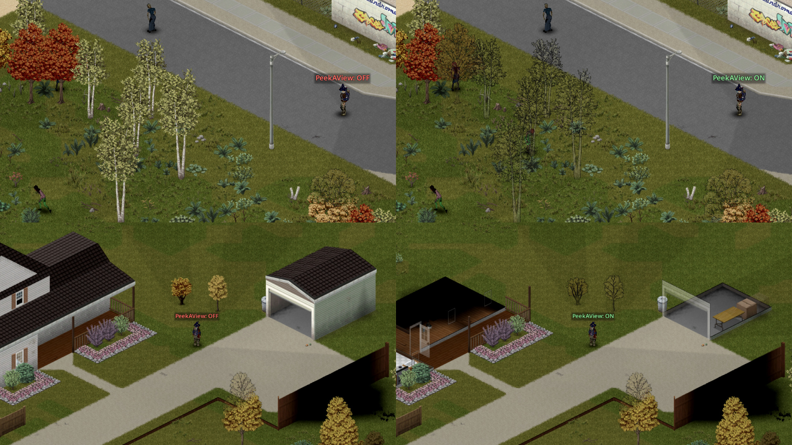

# Peek a View

> Expand your vision.

Project Zomboid hides a lot of what's actually visible to your character behind walls, trees, and floors above. PeekAView extends three rendering passes so your screen catches up with your character's eyes. Three independent features:

- **Wall cutaway**: walls and fences fade earlier as you approach them.
- **Tree fade**: trees in your character's view become translucent.
- **Stair view**: while climbing stairs, the upper floor already renders.

Each feature is independent. Run all three together, just the one you need, or somewhere in between. Every feature has its own Enable toggle, and the wall and tree fade ranges are tunable in the Options menu.

**F8** toggles the master Enable in-game (rebindable under `[PeekAView]` in PZ's keybind menu).

Same rules as vanilla. No X-ray, no see-through walls, no enemy outlines. Your character's line of sight still decides what's actually visible.

## Requirements

- **Project Zomboid** Build 42.13 or newer
- **[ZombieBuddy](https://steamcommunity.com/sharedfiles/filedetails/?id=3619862853)**: Java bytecode patching framework (required, one-time setup)

## Installation

1. Subscribe to **[ZombieBuddy](https://steamcommunity.com/sharedfiles/filedetails/?id=3619862853)** on the Steam Workshop and follow its one-time setup instructions. This step is only needed once: all mods that depend on ZombieBuddy work automatically afterwards.
2. Subscribe to **[Peek a View](https://steamcommunity.com/sharedfiles/filedetails/?id=3710281407)**.
3. Enable both mods in the in-game mod list and launch the game.

Because Peek a View ships a Java JAR, the **first** time you launch the game after installing it, ZombieBuddy will show a native approval dialog with the mod name, the signing author's Steam name and ID, the author's Steam ban status, and an `updated` date. Tick `Allow` to approve this specific JAR, or also tick `Trust` to silently accept future updates signed by the same author key without re-approving on each release. A persist-decision checkbox at the bottom saves your choice.

## Compatibility

- Safe to add or remove mid-save: no save data touched. Visual effects clear on the next save reload after removing the mod from the mod list.
- Client-side only: each player who wants the effect needs the mod (and ZombieBuddy) installed.

## Wall cutaway

Walls and fences fade as you walk toward them, not after you've already reached them. You can take wider arcs around obstacles, peek through doorways and windows from further out, and watch a building's far walls fade in your approach: you commit to entering with a clearer picture of what's on the other side.

Also includes a workaround for a B42 engine bug where player-built structures next to vanilla buildings can hide the upper-floor walls of those buildings entirely.

| Setting | Range / Default | What it does |
|---|---|---|
| Enable | on | Toggles the wall cutaway feature. The B42 fix is gated by this enable as well. |
| Range | 5–20, default 10 | How far walls fade around the player. `5` = pure vanilla; lower values improve performance. |
| Active only when aiming | off | Active only while aiming a weapon (right-click held). |
| Active in vehicles | on | When on, cutaway runs while driving. When off, on foot only. |
| Fix B42 wall-hiding bug | on | Workaround for the vanilla B42 bug. |

## Tree fade

Trees in your character's forward view become translucent so you can see what's behind them. Useful on foot to spot zombies hiding in tree lines, and especially useful while driving: road hazards behind a tree show up earlier instead of only once the tree has cleared the bumper.

| Setting | Range / Default | What it does |
|---|---|---|
| Enable | on | Toggles the tree fade feature. |
| Range | 5–25, default 15 | How far trees fade around the player. Lower values improve performance. |

## Stair view

While your character is on stairs, the upper floor renders during the climb instead of only after you've topped out. You see what's waiting upstairs before you reach it.

| Setting | Default | What it does |
|---|---|---|
| Enable | on | Toggles the stair view feature. |

If the [Staircast Workshop mod](https://steamcommunity.com/sharedfiles/filedetails/?id=3684713089) is also subscribed, PeekAView detects it at runtime and yields its own stair view, so both mods can coexist.

Based on the [Staircast Workshop mod](https://steamcommunity.com/sharedfiles/filedetails/?id=3684713089) by copiumsawsed. Read-path implementation details in [armakupub/staircast-rp](https://github.com/armakupub/staircast-rp).

## FAQ

**Does it conflict with the Staircast Workshop mod?** No. If both are subscribed, PeekAView detects Staircast at runtime and yields its own stair view so the two can run together.

**Does it work in multiplayer?** Yes, client-side only. Every client also needs ZombieBuddy installed.

**I disabled PeekAView in the mod list mid-session but the effects are still showing. What now?** Project Zomboid keeps mod code in memory across save reloads, so disabling PeekAView in the mod list mid-session doesn't shut it down on its own. Three ways to clear it: (1) toggle it off via the mod's own in-game settings (instant), (2) reload your save (PeekAView checks the active mod list on each save load and self-deactivates if it's no longer there), or (3) restart PZ. This is an already-reported framework-level limitation.

**Does it affect performance?** Several caches keep the runtime cost close to vanilla. Standing still and walking on foot are the cheapest paths. Lower the range sliders if your hardware struggles.

## Building from Source

One-time setup:

1. Extract a [Zulu JDK 25](https://www.azul.com/downloads/) Windows x64 build into `tools/` (needs `tools/zulu*-win_x64/bin/javac.exe`).
2. Copy `build.local.example` to `build.local` and set `PZ_DIR` to your PZ install.
3. Ensure `ZombieBuddy.jar` sits next to `projectzomboid.jar` in your PZ install.

Then `./build.sh` compiles, packages `peekaview.jar`, and installs to `%USERPROFILE%/Zomboid/mods/PeekAView`.

Technical documentation for contributors is under [`docs/`](docs/).

## Links

- **GitHub:** https://github.com/armakupub/PeekAView
- **Steam Workshop:** https://steamcommunity.com/sharedfiles/filedetails/?id=3710281407
- **staircast-rp:** https://github.com/armakupub/staircast-rp (read-path implementation referenced by the Stair view feature)

## Attribution

- **Cutaway-on-stairs idea + FakeFrameState pattern + choice of patched render classes**: [copiumsawsed/pz-Staircast](https://github.com/copiumsawsed/pz-Staircast) (MIT, original Workshop mod).
- **Read-path implementation** (reflective `x/y/z` field-write + ThreadLocal-gated shadow on `IsoMovingObject` getters): first published as our standalone fork [armakupub/staircast-rp](https://github.com/armakupub/staircast-rp) (MIT).
- **PeekAView extensions on the staircast-rp foundation**: stair-tile latch, cone-vision zombie alpha override with smooth fade-out, getModIDs-based external-stair detection, self-check, pause-resistant freeze, multi-patch ordering fixes.

## License

MIT, see `LICENSE`.
