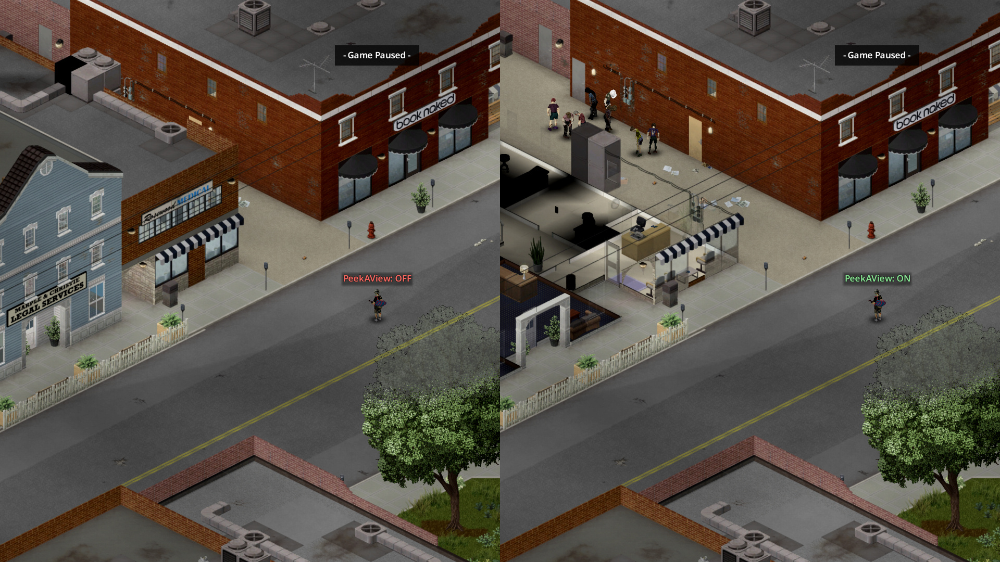
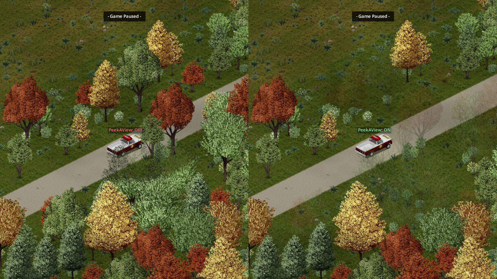
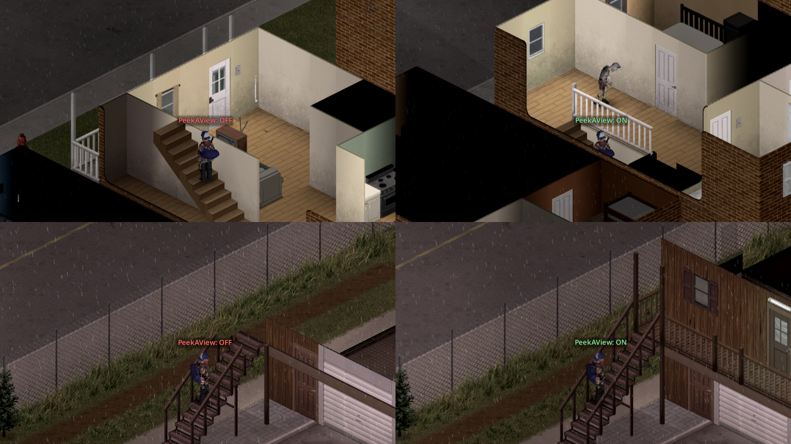
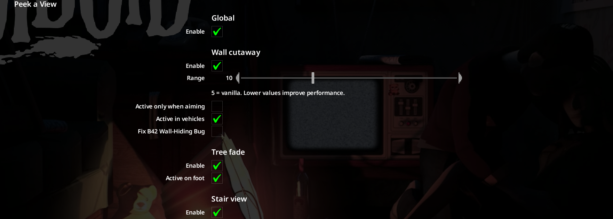

# Peek a View

Your character sees more than your screen shows. Walls hide the corner they're staring down, a tree crown covers the zombie on the road, and a staircase is a blind climb into whatever waits at the top. PeekAView closes that gap in three places:

- **Wall cutaway**: walls start cutting away at greater distance, so doorways and corners open up as you approach instead of at the last step.
- **Tree fade**: trees between you and where you're looking turn see-through, on foot and behind the wheel.
- **Stair view**: the upper floor draws while you climb, so you see what's waiting before you get there. Zombies in the room you're climbing into stay visible through the whole climb, anywhere in that room.

To be clear: no wallhack. Your character's line of sight still decides everything, the mod only draws what the game already counts as seen but keeps hidden.

Every feature has its own toggle under Options → Mods → Peek a View, and **F8** switches the whole mod on and off in game (rebindable under `[PeekAView]` in PZ's keybind menu).

<table>
  <tr>
    <td></td>
    <td></td>
  </tr>
  <tr>
    <td></td>
    <td></td>
  </tr>
</table>

## Maintenance status

This is the mod in its finished shape. I play with it myself, so breakage from game updates gets fixed when I run into it, but no new features are planned. Last tested against PZ build 42.20.2.

Source is MIT-licensed. Forks and improvements are welcome and encouraged. If a maintained successor appears, I'll link to it here.

Issues and PRs will be read but I can't promise response times. If the mod breaks in a future PZ version and I'm not going to fix it, I'll remove it from the Workshop rather than leave a broken version up.

## Requirements

- **Project Zomboid** Build 42.20 or newer
- **[ZombieBuddy](https://steamcommunity.com/sharedfiles/filedetails/?id=3619862853)**: Java bytecode patching framework (required, one-time setup)

## Installation

1. Subscribe to **[ZombieBuddy](https://steamcommunity.com/sharedfiles/filedetails/?id=3619862853)** on the Steam Workshop and follow its one-time setup instructions. This step is only needed once: all mods that depend on ZombieBuddy work automatically afterwards.
2. Subscribe to **[Peek a View](https://steamcommunity.com/sharedfiles/filedetails/?id=3710281407)**.
3. Enable both mods in the in-game mod list and launch the game.

Because Peek a View ships a Java JAR, the **first** time you launch the game after installing it, ZombieBuddy will show a native approval dialog with the mod name and an `updated` date. Tick `Allow` to approve this specific JAR. A persist-decision checkbox at the bottom saves your choice for future updates.

## Compatibility

- Safe to add or remove mid-save: no save data touched. Visual effects clear on the next save reload after removing the mod from the mod list.
- Client-side only (the server runs none of it), but in multiplayer it still has to be on the server's mod list. Each player who wants the effect needs the mod (and ZombieBuddy) installed.

## Wall cutaway

Walls and fences fade as you walk toward them, not after you've already reached them. You can take wider arcs around obstacles, peek through doorways and windows from further out, and watch a building's far walls fade in your approach: you commit to entering with a clearer picture of what's on the other side.

Also includes an opt-in workaround for a B42 engine bug where player-built structures next to vanilla buildings can hide the upper-floor walls of those buildings entirely.

| Setting | Range / Default | What it does |
|---|---|---|
| Enable | on | Toggles the wall cutaway feature. The B42 fix is gated by this enable as well. |
| Range | 5–20, default 10 | How far walls fade around the player. `5` = pure vanilla; lower values improve performance. |
| Active only when aiming | off | Active only while aiming a weapon (right-click held). |
| Active in vehicles | on | When on, cutaway runs while driving. When off, on foot only. |
| Fix B42 wall-hiding bug | off | Opt-in workaround for the vanilla B42 bug — enable it if upper-floor walls vanish next to your player-built structures. Trade-off: player-built tiles attached to a vanilla facade can stay visible where vanilla would hide them. |

## Tree fade

Whole trees fade in your view direction, on foot and behind the wheel. The fade knows tree sizes: reach per class comes from the actual sprite heights (saplings, normal trees, and the three jumbo tiers), so a small fir far down-screen no longer ghosts while a jumbo crown covering you stays solid. Trees right at the character or the car fade regardless of facing, and faded trees keep a readable silhouette, easing down to the deep fade only while they actually cover the character.

Aiming (right mouse button held) reveals along your aim direction instead of fading trees across the whole screen. Releasing the aim key fades revealed trees back in smoothly, and jumbo trees swap cleanly to the cut trunk while aiming.

Driving uses the same model with a travel-direction cone (it flips while reversing): trees drop out quicker the faster you drive, and passed trees always fade back in at the normal rate.

Build 42.20 ships its own on-foot tree fade; PeekAView replaces it with this whole-tree model. If you'd rather keep the vanilla version, untick "Active on foot" and PeekAView will only fade trees while you drive.

| Setting | Default | What it does |
|---|---|---|
| Enable | on | Toggles the tree fade feature. |
| Active on foot | on | Fades trees in your view cone while walking, replacing the round reveal mask around the character. When off, tree fade runs only while driving. |

## Stair view

While your character is on stairs, the upper floor renders during the climb instead of only after you've topped out. You see what's waiting upstairs before you reach it. Zombies in the room you're climbing into stay visible through the whole climb, anywhere in that room, limited to your character's forward view.

| Setting | Default | What it does |
|---|---|---|
| Enable | on | Toggles the stair view feature. |

If the [Staircast Workshop mod](https://steamcommunity.com/sharedfiles/filedetails/?id=3684713089) is also subscribed, PeekAView detects it at runtime and yields its own stair view, so both mods can coexist.

Based on the [Staircast Workshop mod](https://steamcommunity.com/sharedfiles/filedetails/?id=3684713089) by copiumsawsed. Read-path implementation details in [armakupub/staircast-rp](https://github.com/armakupub/staircast-rp).

## FAQ

**Does it conflict with the Staircast Workshop mod?** No. If both are subscribed, PeekAView detects Staircast at runtime and yields its own stair view so the two can run together.

**Does it work in multiplayer?** Yes, client-side only. Every client also needs ZombieBuddy installed.

**I disabled PeekAView in the mod list mid-session but the effects are still showing. What now?** Project Zomboid keeps mod code in memory across save reloads, so disabling PeekAView in the mod list mid-session doesn't shut it down on its own. Three ways to clear it: (1) toggle it off via the mod's own in-game settings (instant), (2) reload your save (PeekAView checks the active mod list on each save load and self-deactivates if it's no longer there), or (3) restart PZ. This is an already-reported framework-level limitation.

**Does it affect performance?** Several caches keep the runtime cost close to vanilla. Standing still and walking on foot are the cheapest paths. Lower the cutaway range slider if your hardware struggles.

## Building from Source

One-time setup:

1. Extract a [Zulu JDK 25](https://www.azul.com/downloads/) Windows x64 build into `tools/` (needs `tools/zulu*-win_x64/bin/javac.exe`).
2. Copy `build.local.example` to `build.local` and set `PZ_DIR` to your PZ install.
3. Ensure `ZombieBuddy.jar` sits next to `projectzomboid.jar` in your PZ install.

Then `./build.sh` compiles, packages `peekaview.jar`, and installs to `%USERPROFILE%/Zomboid/mods/PeekAView`.

Technical documentation for contributors is under [`docs/`](docs/).

## Links

- **GitHub:** https://github.com/armakupub/PeekAView
- **Steam Workshop:** https://steamcommunity.com/sharedfiles/filedetails/?id=3710281407
- **staircast-rp:** https://github.com/armakupub/staircast-rp (read-path implementation referenced by the Stair view feature)

## Attribution

- **Cutaway-on-stairs idea + FakeFrameState pattern + choice of patched render classes**: [copiumsawsed/pz-Staircast](https://github.com/copiumsawsed/pz-Staircast) (MIT, original Workshop mod).
- **Read-path implementation** (reflective `x/y/z` field-write + ThreadLocal-gated shadow on `IsoMovingObject` getters): first published as our standalone fork [armakupub/staircast-rp](https://github.com/armakupub/staircast-rp) (MIT).
- **PeekAView extensions on the staircast-rp foundation**: stair-tile latch, cone-vision zombie alpha override gated to the landing room with smooth fade-out, getModIDs-based external-stair detection, self-check, pause-resistant freeze, multi-patch ordering fixes.

## License

MIT, see `LICENSE`.
